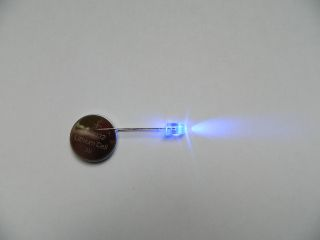

1. Nu ga je je eerste elektronische circuit maken! Neem een gewone LED \(eentje met twee pinnen in plaats van een naai-LED\) en maak verbinding met de batterij door de twee pinnen tegen de batterij te houden. Zie je dat één van de pinnen langer is dan de andere? De langste pin houd je tegen de '+' kant van de batterij aan. Zie je dat de LED oplicht?  
   \* Werkt het? Zo nee, zaten de pinnen op de juiste manier tegen de batterij aan?  
   

   \* Draai de batterij om zodat de pinnen verkeerd tegen de batterij aan komen \(dus de kortste pin tegen de '+' kant\). Werkt het nu nog?

2. In elk circuit heb je een **positieve +** en een **negatieve -** richting. Om elektriciteit te laten stromen moeten de** +** en de **+**, en de **-** en de **-** kanten van je onderdelen elkaar raken. Dit is waarom de LED niet werkt als je de batterij omdraait.

3. Bij LED geldt: de langste pin is **+** en de kortste pin is **-**. Je kunt ook zien wat de **-** is door heel goed naar het lampje te kijken: de kant met de platte rand.

4. Haal de LED van de batterij en stop de batterij in de houder met de + kant naar boven \(de houder heeft ook een + teken\). Pak nu twee stukken geleidedraad. Werk eventueel samen met de ninja naast je.

5. Stop één kant van de eerste draad door het **+** gat van de batterijhouder, zorg ervoor dat de draad het metaal raakt en houd het andere eind tegen de **positieve** pin van de LED. Je kunt tape gebruiken, maar de draad gaat daardoor wat rafelen. Je kunt ook krokodillenklemmen gebruiken in plaats van draad.  
   

6. Pak nu de tweede draad. Stop één kant van deze draad in het **-** gat van de batterijhouder en houd het andere eind tegen de **negatieve** pin van de LED.  
   

7. Zorg ervoor dat de twee draden elkaar nergens raken. Raken ze elkaar wel dan krijg je **kortsluiting** en werkt er niets.  
   \* Als je **kortsluiting** krijgt dan probeert elektriciteit de kortst mogelijke route te nemen door het circuit en slaat dan onderdelen over: daarom werkt er dan niets.

8. Nu heb je een circuit en kun je een oplichtende badge gaan maken!

