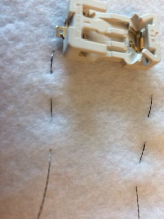

1. Nu komen naald en draad uit het vilt waar de LED is vastgenaaid. Stel je een lijn voor tussen deze plek en de plek die je gemarkeerd hebt voor het **-** punt van de batterijhouder. Teken die lijn op het vilt als je wilt. Je gaat nu een **rijgsteek** gebruiken om de LED aan de batterijhouder te verbinden.

2. Zet de punt van de naald op de lijn op ongeveer 1 cm van waar de naald uit het vilt komt, duw de naald door het vilt en haal de draad er weer helemaal doorheen.

3. Herhaal stap 2 aan de achterkant van het vilt. Blijf dit doen tot je bij de plek komt die je gemarkeerd hebt voor het **-** gat van de batterijhouder.

4. Plaats nu je batterijhouder op het vilt. Dan doe je hetzelfde als bij de LED: zet de batterijhouder vast met drie steken door het **-** gat. Onthoud dat je de draad ook hier weer strak moet trekken!

5. Daarna maak je drie hele kleine steekjes vlak naast de batterijhouder, alle drie op dezelfde plek. Dit is om ervoor te zorgen dat de draad en dus al je werk niet losrafelt.

6. Knip de draad door zodat er nog een heel klein stukje uit het vilt steekt.  
   \* Hier vindt je een video voor dat laatste stukje: [https://dojo.soy/wear-finishing](https://www.youtube.com/watch?v=pUjeQAXHf2U&feature=youtu.be)

7. Nu heb je een half circuit genaaid. Om het circuit compleet te maken moet je het **+** gat van de LED verbinden met het **+** gat van de batterijhouder. Gebruik dezelfde methode als bij de **negatieven**. Ik heb geen switch in dat circuit geplaatst, maar dat kun je wel doen door een derde draad te gebruiken.  
   \* _Belangrijk!_ Zorg dat je draad voor de **positieve** gaten _helemaal nergens_ de draad voor de **negatieve** gaten raakt en ook nergens tegen de batterijhouder aankomt. Denk erom: anders creëer je kortsluiting \(niet goed!\)  
   

8. Plaats een batterij in de batterijhouder en zie je LED oplichten :\)

9. Als je een veiligheidsspeld op je badge wilt, dan is het een goed idee om een apart stukje vilt aan de achterkant van je badge te plaatsen. Dit om er zeker van te zijn dat de veiligheidsspeld nergens je circuit raakt - aangezien de speld van metaal is kan deze kortsluiting veroorzaken. Gebruik gewoon naaigaren \(of lijm, of tape\) voor dit stukje.

10. Als je wilt, kun je ook extra vilt over de batterijhouder plaatsen. Je kunt je badge ook versieren met vilt of naaigaren van een andere kleur. Als je vilt over de LED plaatst dan zie je een zachte gloed als de LED oplicht. Jij maakt je eigen mode!

11. Gefeliciteerd! Je badge is klaar en je hebt een compleet wearable circuit genaaid. De volgende Sushi kaarten laten je zien hoe je extra LEDS kunt toevoegen en zijn optioneel.

